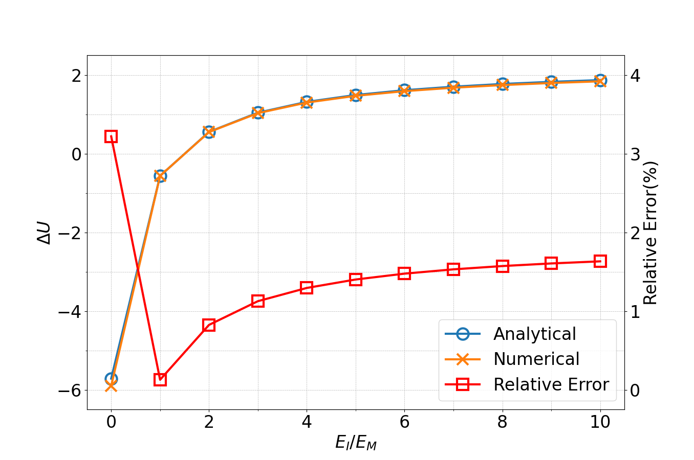
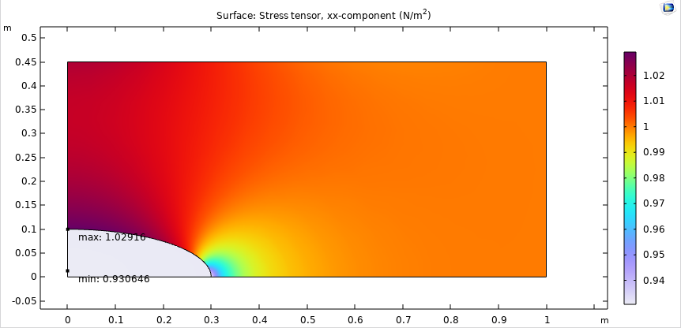
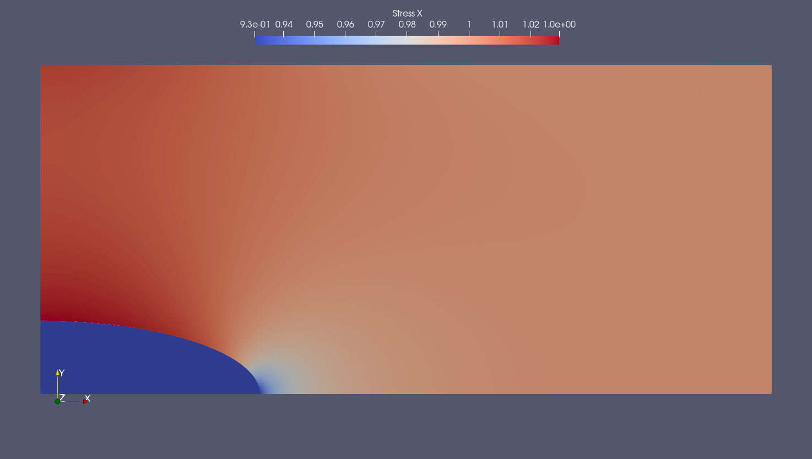

# myFEM
For some homework

### Element Implementation
- Rectangle Serendipity 2D

### Depends on
1. [Gmsh](https://gmsh.info/)>=4.12.0
2. [tomlplusplus](https://github.com/marzer/tomlplusplus)
3. [Eigen](https://eigen.tuxfamily.org/)
4. [VTK](https://vtk.org/)

### Build
1. Configure the project with CMake
```bash
cmake -B build -DCMAKE_BUILD_TYPE=Release
```
2. Build the project
```bash
cmake --build build -j
```
- Or just build the `PyWorker` library
```bash
cmake --build build -j --target PyWorker
```
3. Go to the python directory
```bash
cd python
```
4. Before run the python script, you may need to modify the `libraryWrapper.py`. For example, if you built the library in `python/library/build` directory and decide to run python script in `python` directory, you should modify the `libraryWrapper.py` as follows:
```python
class PyWorkerWrapper:
    def __init__(self, libName: str = "PythonWorker", libDirectory: str = "./lib"):
        # Change the libDirectory to your library directory
        libDirectory = "./library/build"
        # Get system name
        ...
```
- If you follow the above steps, you can create a soft link to the library directory:
```bash
ln -s ../build/work lib
```
5. Check all the python dependencies listed in the `requirements.txt` are installed
6. Now, run the python script
```bash
python Question2.py
```

### Result
#### Question 2
<p align="center">

#### Singleton
<table>
<tr><td> COMSOL
</td><td>  </td>
<tr><td> This work
</td><td>  </td>
</table>